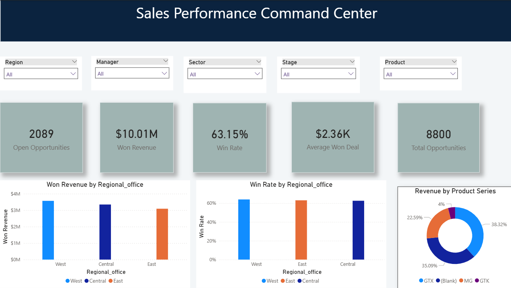

# Revenue Operations & Sales Pipeline Analytics | SQL Server + Power BI

Turning sales opportunity data into trustworthy reporting, pipeline-health monitoring, and actionable commercial insights.



## Revenue Operations Use Case

This project simulates a Revenue Operations analytics workflow using sales opportunity data structured around a CRM-style pipeline.

The objective is not only to create dashboards, but to make sure the underlying commercial data is accurate, consistent, and useful for decision-making.

The analysis supports Revenue Operations questions such as:

* How much pipeline is currently open?
* How effectively are opportunities converting into won business?
* Which products and regions contribute the most revenue?
* Which opportunities may require sales follow-up?
* Are reporting totals reliable after combining multiple datasets?
* Are there duplicate, missing, or incorrectly mapped records?
* Which metrics should Sales and Revenue Operations monitor consistently?

The workflow follows a practical RevOps reporting process:

**Raw opportunity data → Data quality checks → Data cleaning → Reporting view → Metric validation → Pipeline analysis → Power BI reporting → Business recommendations**

---

## RevOps Highlight: 90+ Day Pipeline Follow-Up

One of the key analyses in this project focuses on **pipeline aging**.

Open opportunities are grouped into:

* 0–30 days
* 31–60 days
* 61–90 days
* Over 90 days

The analysis then identifies individual opportunities that have remained in the **Engaging** stage for more than 90 days.

This creates an actionable follow-up list containing:

* Opportunity ID
* Sales agent
* Manager
* Regional office
* Product
* Account
* Engagement date
* Opportunity age in days

### Why this matters

A Revenue Operations team should not only report how much pipeline exists. It should also identify pipeline that may be stalled, outdated, or require intervention.

The 90+ day analysis helps Sales and RevOps teams prioritize older opportunities for review instead of treating every open opportunity equally.

The SQL uses a dataset-based snapshot date rather than today's date so that the historical dataset is analysed consistently.

---

## Business Problem

Sales and Revenue Operations leaders need reliable answers to questions such as:

* Which products and regions drive revenue?
* How effectively do opportunities convert?
* Where is pipeline becoming stale?
* Which accounts contribute most to revenue?
* Can the underlying CRM-style data be trusted?
* Do reporting totals reconcile after multiple datasets are joined?

This project combines four sales datasets in SQL Server, resolves data-quality issues, validates reporting totals, and analyses revenue, conversion, deal value, pipeline aging, and account concentration.

---

## Project Overview

| Dataset        | Records | Purpose                                          |
| -------------- | ------: | ------------------------------------------------ |
| Sales Pipeline |   8,800 | Opportunities, stages, dates, and closing values |
| Accounts       |      85 | Customer sectors and locations                   |
| Products       |       7 | Product series and reference prices              |
| Sales Teams    |      35 | Agents, managers, and regional offices           |

**Reporting grain:** One row per opportunity

**Tools:** SQL Server, SQL Server Management Studio, Power BI

---

## Key Results

* Validated **8,800 rows and 8,800 unique opportunities** after joining the four datasets.
* Corrected **1,480 product-name mismatches**, standardizing `GTXPro` to `GTX Pro`.
* Corrected account-sector and country spelling inconsistencies.
* Preserved original imported data and applied corrections to separate clean tables.
* Reconciled total won revenue to **10,005,534.00**.
* Identified **4,238 won**, **2,473 lost**, and **2,089 open opportunities**.
* Calculated a **63.15% closed-deal win rate** using Won ÷ (Won + Lost).
* Created pipeline-aging groups to identify opportunities requiring follow-up.
* Built an individual **90+ day opportunity follow-up list**.
* Analysed customer revenue concentration using SQL window functions.

---

## Data Quality & Reporting Controls

Before analysing business performance, the project validates whether the reporting layer can be trusted.

Checks include:

* Row-count reconciliation against source datasets
* Duplicate opportunity IDs
* Duplicate lookup keys
* NULL profiling by deal stage
* Product mapping validation
* Account mapping validation
* Sales-agent mapping validation
* Invalid closing dates
* Negative closing values
* Joined-row reconciliation
* Revenue reconciliation

Open opportunities intentionally retain NULL closing dates and closing values because these deals do not yet have a final outcome.

These NULL values are therefore treated as valid business states rather than automatically replacing them with zero or fabricated dates.

A `LEFT JOIN` is used where opportunities may not have an assigned account, while product and sales-agent relationships use validated joins after key-quality checks.

---

## Reporting Layer

A reusable SQL reporting view, `dbo.vw_sales_analysis`, combines opportunity, account, product, and sales-team data.

The reporting layer is designed around:

**One row per opportunity**

Maintaining the correct reporting grain is important because incorrect joins can duplicate opportunities and inflate metrics such as pipeline or revenue.

Before using the reporting view for analysis, both opportunity counts and revenue totals are reconciled against the source data.

---

## Revenue Operations Metrics

Metric definitions are documented separately in:

**[`metric_dictionary.md`](metric_dictionary.md)**

Core metrics include:

| Metric                 | Purpose                                                 |
| ---------------------- | ------------------------------------------------------- |
| Won Revenue            | Measures revenue from successfully closed opportunities |
| Closed Win Rate        | Measures conversion across completed opportunities      |
| Open Opportunities     | Measures current pipeline volume                        |
| Average Won Deal Value | Measures average value of won opportunities             |
| Pipeline Age           | Measures how long open opportunities have been active   |
| 90+ Day Opportunities  | Identifies older pipeline requiring review              |
| Account Revenue Share  | Measures customer revenue concentration                 |

---

## Business Findings

### 1. Deal volume does not equal revenue contribution

`GTX Basic` recorded the highest number of won deals with **915**, but generated **499,263.00** in won revenue.

`GTX Pro` generated **3,510,578.00** from **729 won deals**.

This demonstrates why Revenue Operations should monitor both deal volume and deal value rather than evaluating performance using opportunity counts alone.

**Recommended investigation:** Examine product mix and appropriate upsell opportunities while considering customer needs and profitability.

---

### 2. Central generated the most won deals but had the lowest average won deal value

| Region  | Won Deals | Win Rate |  Won Revenue | Avg. Won Deal Value |
| ------- | --------: | -------: | -----------: | ------------------: |
| West    |     1,438 |   63.94% | 3,568,647.00 |            2,481.67 |
| Central |     1,629 |   62.56% | 3,346,293.00 |            2,054.20 |
| East    |     1,171 |   63.02% | 3,090,594.00 |            2,639.28 |

Central generated the largest number of won opportunities but the lowest average won deal value.

**Recommended investigation:** Break the difference down by product and customer mix before attributing the gap to sales-agent performance.

This avoids drawing a performance conclusion without sufficient supporting evidence.

---

### 3. High-value products require sample-size awareness

`GTK 500` produced an average won deal value of **26,707.47**, but the result came from only **15 won deals**.

A high average deal value alone therefore does not establish future growth potential.

**Recommended investigation:** Analyse the product further while accounting for its small sample size.

---

### 4. Older pipeline should be separated from healthy active pipeline

Open opportunities are not automatically equally valuable.

The project calculates opportunity age and separates the engaging pipeline into 30-day aging bands.

Opportunities older than **90 days** are then extracted into an individual follow-up list.

**Recommended action:** Sales or Revenue Operations teams could review these opportunities to determine whether they remain active, require intervention, need updated expected-close information, or should be removed from active pipeline reporting.

---

## SQL Skills Demonstrated

The project demonstrates practical SQL used for Revenue Operations and business analytics, including:

* `GROUP BY`
* `HAVING`
* `CASE`
* `INNER JOIN`
* `LEFT JOIN`
* Common Table Expressions (CTEs)
* Window functions
* `ROW_NUMBER()`
* `SUM() OVER()`
* `DATEDIFF`
* `NULLIF`
* Conditional aggregation
* Text standardization
* Data-quality profiling
* Reporting views
* Decimal casting
* Transactions for safer updates
* Revenue reconciliation
* Pipeline-aging calculations

---

## Power BI Dashboard

The SQL reporting layer is connected to Power BI to provide a business-facing view of pipeline and sales performance.

The dashboard is designed to help stakeholders move from raw opportunity records toward understandable commercial metrics.


Power BI file:

`Sales_pipeline_performance.pbix`

---

## Project Files

```text
sales-pipeline-analytics-sql-server/
│
├── README.md
├── metric_dictionary.md
├── revenue_operations_analysis.sql
├── Sales_pipeline_performance.pbix
└── dashboard-overview.png
```

---

## How to Reproduce

1. Import the four source datasets into SQL Server.
2. Profile row counts, data types, duplicate records, and NULL values.
3. Preserve the imported source tables.
4. Create clean copies for standardized values.
5. Validate product, account, and sales-agent lookup keys.
6. Apply controlled data-quality corrections.
7. Create `dbo.vw_sales_analysis`.
8. Validate that the reporting view remains at one row per opportunity.
9. Reconcile opportunity counts and won revenue.
10. Run pipeline, product, regional, account, and aging analyses.
11. Connect the reporting layer to Power BI.

---

## Limitations

This portfolio project uses a historical dataset rather than a live CRM environment.

The dataset does not contain several fields that would normally be available in a production Revenue Operations environment, including:

* Sales quotas and targets
* Forecast categories
* Renewal dates
* Customer retention metrics
* Campaign attribution
* Lead-quality metrics
* Loss reasons
* Profit or cost information

Revenue represents the closing value of won opportunities and should not be interpreted as profit.

The project does not claim to use Salesforce or Snowflake. SQL Server is used as the analytical database, while the underlying concepts—reporting grain, joins, data validation, metric definitions, reconciliation, and pipeline analysis—are transferable to CRM and cloud-data-warehouse environments.

Recommendations presented in the project are analytical proposals rather than implemented or experimentally measured business outcomes.

---

## What I Would Add in a Production RevOps Environment

With access to production CRM and GTM systems, the next reporting layer could include:

**Lead → Opportunity → Booking → Renewal**

Additional analysis could cover:

* Pipeline coverage
* Forecast accuracy
* Quota attainment
* Sales-cycle duration
* Stage-to-stage conversion
* Renewal calendars
* Retention and churn
* Campaign-influenced pipeline
* Account coverage
* Rep performance
* Automated data-quality alerts

---

## Author

**Govinda Choudhary**

Reporting & Revenue Analytics | SQL | Power BI
